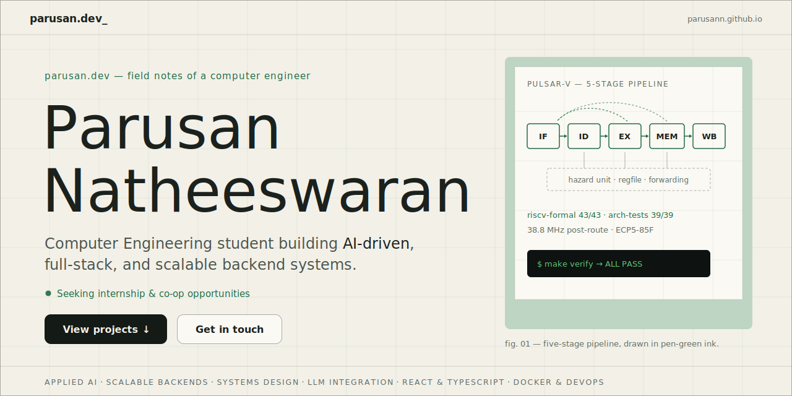

# Parusan Natheeswaran Portfolio

<div align="center">



Handcrafted portfolio website for showcasing software engineering, AI, backend systems, and full-stack work.

[](https://parusann.github.io/)
[](https://developer.mozilla.org/en-US/docs/Web/HTML)
[](https://developer.mozilla.org/en-US/docs/Web/CSS)
[](https://developer.mozilla.org/en-US/docs/Web/JavaScript)
[](https://parusann.github.io/)

</div>

## Table of Contents

- [Overview](#overview)
- [Quick Stats](#quick-stats)
- [Recruiter Snapshot](#recruiter-snapshot)
- [Why This Portfolio Stands Out](#why-this-portfolio-stands-out)
- [Project Highlights](#project-highlights)
- [Site Sections](#site-sections)
- [Tech Stack](#tech-stack)
- [Project Structure](#project-structure)
- [Implementation Notes](#implementation-notes)
- [Local Development](#local-development)
- [Deployment](#deployment)
- [Social Preview Asset](#social-preview-asset)
- [Customization Ideas](#customization-ideas)
- [Contact](#contact)

## Overview

This repository powers my personal portfolio website, branded as `parusan.dev` and currently published at [parusann.github.io](https://parusann.github.io/).

The site is designed to do more than list experience. It presents my engineering profile like a product:

- a bold landing section with motion and visual depth
- project case studies with strong technical framing
- a clear experience timeline
- a skills section that shows both breadth and current growth areas
- a direct path for recruiters, collaborators, and hiring teams to contact me

The entire site is built with plain HTML, CSS, and JavaScript. No framework, no heavy tooling, and no unnecessary complexity. The goal was to create something that feels polished, fast, and intentional while keeping the codebase simple and easy to maintain.

## Quick Stats

| Area | Snapshot |
| --- | --- |
| Live portfolio | [parusann.github.io](https://parusann.github.io/) |
| Role focus | Software engineering, AI, backend, and systems |
| Opportunity status | Open to internship and co-op roles |
| Featured projects | 4 |
| Experience entries | 3 |
| Core implementation | Static front end with HTML, CSS, and JavaScript |
| Signature interactions | Interactive grid, noise overlay, parallax, staggered reveals, 3D card tilt |

## Recruiter Snapshot

If you are reviewing this repository as part of a hiring process, this portfolio is built to make three things immediately clear:

- I build across the stack, from front-end presentation to backend systems and deployment-minded architecture
- my strongest interests sit at the intersection of applied AI, scalable systems, and product-focused software engineering
- I am actively seeking internship and co-op opportunities where I can contribute quickly and keep growing as a builder

What you will find in this repo and on the live site:

- a custom portfolio instead of a recycled template
- featured projects with concrete technical highlights
- a clear view of experience, tools, and current learning direction
- direct contact paths for follow-up

## Why This Portfolio Stands Out

This is not a generic template portfolio. It is a custom-built static site with a distinct visual identity and hand-coded interactions.

### Visual direction

- deep-space green and amber color palette
- glassmorphism-inspired cards with layered shadows and lighting
- cinematic hero section with image, overlay, gradient, and scroll cues
- technical typography using `Outfit` and `JetBrains Mono`

### Interaction design

- canvas-based interactive grid that reacts to cursor position
- animated film-grain noise overlay for atmosphere
- staggered reveal animations using `IntersectionObserver`
- parallax motion in the hero section
- mouse-reactive 3D tilt and glare on glass cards
- active navigation state tracking while scrolling
- mobile navigation toggle for smaller screens

### Content strategy

- strong engineering-focused introduction
- featured project breakdowns instead of shallow one-line summaries
- balanced mix of AI, backend, full-stack, and systems work
- professional experience, certifications, and active learning areas all in one place

## Project Highlights

| Project | Focus Area | Stack | What Makes It Strong |
| --- | --- | --- | --- |
| Xenolinguist | Applied AI tooling | React 19, TypeScript, Node.js, Express, Ollama, Tailwind CSS, Vite | Local AI workflow, six-phase decoding system, streaming chat, keyboard-driven UX |
| Bingery | Full-stack product build | Python, Flask, React, PostgreSQL, Claude API | Authenticated API platform with recommendations, live search, GraphQL data integration, deployment pipeline |
| Distributed URL Shortener | Backend systems | Go, Redis, PostgreSQL, Docker, REST APIs | Built for concurrency, caching, low latency, and containerized deployment |
| Bookstore Management System | Object-oriented desktop app | Java, Java Swing, UML, OOP Design | Strong fundamentals in architecture, state management, persistence, and inventory flows |

## Site Sections

### 1. Hero

The landing section introduces the portfolio with a strong personal headline, positioning statement, internship/co-op availability, and fast-access calls to action for projects and contact.

It also includes:

- GitHub, LinkedIn, and email links
- a continuously scrolling skills marquee
- a layered background system made up of a hero image, overlays, and animated canvas effects

### 2. About

The About section frames the overall engineering profile:

- Computer Engineering student at Toronto Metropolitan University
- interested in applied AI, scalable backend systems, and full-stack development
- focused on building software that is both technically deep and practically useful

It is supported by highlight cards covering:

- full-stack development
- AI and machine learning integration
- systems thinking
- cross-functional collaboration

### 3. Featured Projects

The project section is the core of the portfolio. Each entry is presented as a mini case study so visitors can quickly understand the problem space, technical depth, and engineering choices behind the work.

Each project includes:

- custom visual mockups
- a short summary
- the tech stack
- key technical achievements
- direct GitHub links

### Xenolinguist

AI-powered language decoding workbench inspired by *Project Hail Mary*.

Highlights:

- React 19 + TypeScript front end
- Node.js + Express backend
- local AI integration with Ollama
- multi-step decoding workflow
- command palette, keyboard shortcuts, undo system, and audio support

### Bingery

AI-powered anime discovery platform with personalized recommendations.

Highlights:

- Flask + React + PostgreSQL architecture
- JWT auth and relational data model
- Claude API integration with tool use
- AniList GraphQL integration
- deployment pipeline on Render with GitHub CI/CD

### Distributed URL Shortener

Backend-focused systems project centered on concurrency and performance.

Highlights:

- Go API design
- Redis caching layer
- PostgreSQL persistence
- Docker-based deployment
- high-concurrency redirect handling

### Bookstore Management System

Java desktop application focused on object-oriented design and maintainability.

Highlights:

- Java Swing UI
- file-based persistence
- State pattern usage
- authentication and inventory workflows

### 4. Experience

The experience section presents professional work with concise, impact-oriented summaries:

- Machine Learning Engineer at Outlier AI
- Game Developer experience at Riot Games
- Shift Manager experience with operations, leadership, and customer-facing responsibility

### 5. Skills, Certifications, and Learning

This section is intentionally broad so visitors can quickly understand both current strengths and growth direction.

It covers:

- languages
- web and backend technologies
- AI and data tooling
- platforms and engineering tools
- certifications
- current learning areas such as cloud architecture, LLM app development, system design, and Rust

### 6. Contact

The final section makes outreach easy through:

- email
- LinkedIn
- GitHub
- phone

## Tech Stack

### Core technologies

- HTML5
- CSS3
- JavaScript

### Design and layout

- custom CSS variables for theming
- CSS Grid and Flexbox
- responsive breakpoints for tablet and mobile layouts
- handcrafted gradients, glass effects, and motion styling

### JavaScript techniques used

- `requestAnimationFrame` for smooth interaction loops
- `IntersectionObserver` for efficient reveal-on-scroll animations
- DOM event handling for mouse movement, scroll state, and mobile navigation
- canvas rendering for the interactive background and noise overlay

## Project Structure

```text
.
|-- assets/
|   `-- hero-bg.jpg
|-- css/
|   `-- styles.css
|-- js/
|   `-- main.js
|-- index.html
`-- README.md
```

## Implementation Notes

### `index.html`

Defines the complete site structure, including:

- navigation
- hero section
- about section
- featured projects
- experience
- skills and certifications
- learning section
- contact section
- footer

### `css/styles.css`

Contains the full visual system for the site:

- theme variables
- layout rules
- glass card styling
- hero styling
- project cards and mock interfaces
- responsive behavior
- animation states

### `js/main.js`

Handles site interactivity:

- interactive grid canvas
- noise overlay animation
- scroll-triggered reveal effects
- hero parallax
- navbar state changes
- mobile menu toggle
- smooth scrolling
- 3D tilt behavior for cards

## Local Development

This is a static site, so there is no build step and no dependency installation required.

### Clone the repository

```bash
git clone https://github.com/Parusann/Parusann.github.io.git
cd Parusann.github.io
```

### Option 1: Open directly

Open `index.html` in your browser.

### Option 2: Serve locally

Using Python:

```bash
python -m http.server 8000
```

Then open [http://localhost:8000](http://localhost:8000).

## Deployment

This repository is structured as a GitHub Pages portfolio site. Because the repository is named `Parusann.github.io`, it can be served as a user site through GitHub Pages with `index.html` at the project root.

Current live URL:

- [https://parusann.github.io/](https://parusann.github.io/)

## Social Preview Asset

A matching social/share image is included in this repo at [assets/social-preview.svg](assets/social-preview.svg).

If you want GitHub links to this repository to have a custom visual preview, upload that file in the repository's social preview settings.

## Customization Ideas

If this portfolio continues evolving, strong next additions could include:

- project detail pages for deeper case studies
- a downloadable resume button
- analytics for visitor insights
- dark/light theme switching if a second visual mode is ever desired
- blog or writing section for engineering notes and project retrospectives
- accessibility enhancements such as reduced-motion fallbacks for all animated effects

## Contact

For opportunities, collaborations, or questions:

- GitHub: [github.com/Parusann](https://github.com/Parusann)
- LinkedIn: [linkedin.com/in/parusan](https://www.linkedin.com/in/parusan/)
- Email: [pnatheeswaran@torontomu.ca](mailto:pnatheeswaran@torontomu.ca)

I am especially interested in software engineering, AI, backend, and systems-focused internship or co-op roles.

## Usage Note

This repository contains personal branding, project descriptions, and portfolio content specific to Parusan Natheeswaran. Inspiration is welcome, but please do not copy the written content, identity, or branding directly.
